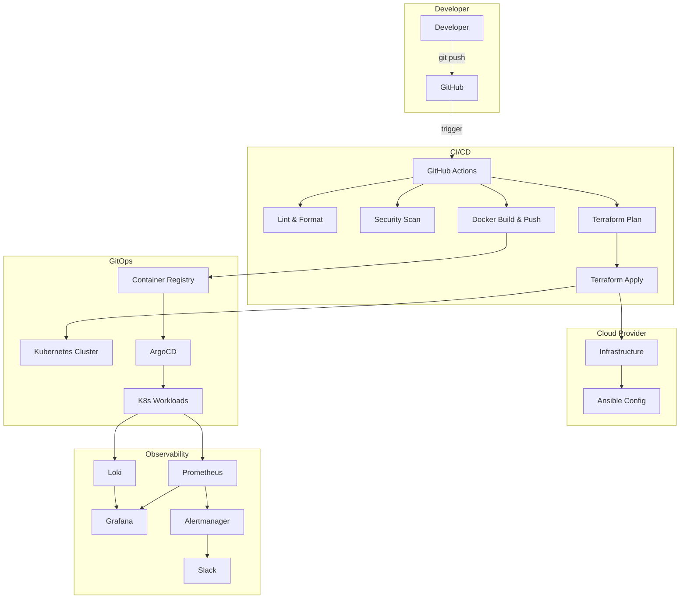

# Infrastructure Boilerplate

[](https://www.terraform.io/)
[](https://www.ansible.com/)
[](https://www.docker.com/)
[](https://kubernetes.io/)
[](https://github.com/your-org/infrastructure-boilerplate/actions/workflows/lint.yml)
[](https://github.com/your-org/infrastructure-boilerplate/actions/workflows/security.yml)
[](https://github.com/your-org/infrastructure-boilerplate/actions/workflows/deploy.yml)
[](LICENSE)
[](CHANGELOG.md)

> A production‑ready, enterprise‑grade Infrastructure‑as‑Code platform combining **Terraform**, **Ansible**, **Docker**, **Kubernetes**, **GitOps**, **CI/CD**, **Monitoring**, and **Security Scanning** into a unified platform engineering template.

---

## Table of Contents

- [Overview](#overview)
- [Architecture](#architecture)
- [Features](#features)
- [Why This Project Exists](#why-this-project-exists)
- [Use Cases](#use-cases)
- [Quick Start](#quick-start)
- [Getting Started](#getting-started)
  - [Prerequisites](#prerequisites)
  - [Local Development (Docker)](#1-local-development-docker)
  - [Provision Infrastructure (Terraform)](#2-provision-infrastructure-terraform)
  - [Configure Servers (Ansible)](#3-configure-servers-ansible)
  - [Deploy to Kubernetes](#4-deploy-to-kubernetes)
- [Repository Structure](#repository-structure)
- [CI/CD Pipelines](#cicd-pipelines)
- [Security](#security)
- [Monitoring & Logging](#monitoring--logging)
- [Testing](#testing)
- [Best Practices](#best-practices)
- [Documentation](#documentation)
- [Contributing](#contributing)
- [Roadmap](#roadmap)
- [License](#license)

---

## Overview

This repository provides a complete, reusable foundation for building and managing modern cloud infrastructure across multiple providers (AWS, Hetzner, Proxmox). It integrates the most widely adopted IaC, GitOps, and observability tools into a single, coherent workflow — eliminating the boilerplate work that teams repeatedly reinvent.

**Core components:**

| Component | Tools | Purpose |
|-----------|-------|---------|
| Infrastructure | Terraform | Cloud resource provisioning (VPC, EC2, S3, RDS) |
| Configuration | Ansible | Post-provisioning server setup |
| Local Dev | Docker Compose | Service parity on your workstation |
| Orchestration | Kubernetes + Kustomize | Production-grade container workloads |
| GitOps | ArgoCD | Declarative continuous delivery |
| CI/CD | GitHub Actions | Automated lint, security, build, deploy |
| Metrics | Prometheus + Grafana | Dashboards and alerting |
| Logs | Loki + Promtail | Lightweight log aggregation |
| Backup | Velero | Kubernetes disaster recovery |
| Load Testing | k6 | Performance validation |

---

## Architecture



[View full architecture diagrams →](docs/architecture.md)

---

## Features

### Developer Experience
- **Makefile** with 30+ commands for all common operations
- **Pre-commit hooks** for automated linting before commits
- **Multi-environment support** — `dev`, `staging`, `prod` with isolated configs
- **Kustomize overlays** for DRY Kubernetes manifests
- **Conventional Commits** enforcement via PR templates

### Security
- **SOPS + age** for secrets encryption in Git
- **Automated security scanning** — tfsec, Trivy, kube-score, checkov, gitleaks
- **IAM least-practice** guidelines and OIDC integration
- **Kubernetes RBAC** and Pod Security Standards
- **OPA/Conftest policies** for policy-as-code enforcement

### CI/CD
- **Multi-stage pipeline** — lint → security → build → plan → apply → deploy
- **Approval gates** for staging and production environments
- **Docker build & push** to GitHub Container Registry
- **ArgoCD auto-sync** for GitOps-based K8s deployments
- **Slack notifications** on pipeline completion

### Observability
- **Prometheus** for metrics collection
- **Grafana** with pre-configured dashboards
- **Loki + Promtail** for log aggregation
- **Alertmanager** with Slack/PagerDuty integration
- **Pre-defined alert rules** for common failure scenarios

### Reliability
- **Terratest** for Terraform integration tests
- **Molecule** for Ansible role testing
- **kubeconform** for Kubernetes manifest validation
- **Velero** for automated Kubernetes backups
- **k6** for load testing

### Multi-Provider
- **AWS** — Full VPC, EC2, EKS, RDS, S3 support
- **Hetzner Cloud** — Cost-effective EU hosting
- **Proxmox VE** — On-premises / homelab support

---

## Why This Project Exists

Teams building cloud infrastructure repeatedly solve the same problems: setting up Terraform state, wiring CI/CD pipelines, writing Ansible roles, crafting Docker Compose files, and authoring Kubernetes manifests. This project consolidates all of those patterns into a single, opinionated template so you can:

1. **Start fast** — No more days of scaffolding. Clone, configure, and deploy.
2. **Follow best practices** — Remote state, matrix CI, modular design, health checks, resource limits.
3. **Scale gradually** — Begin with Docker Compose locally, graduate to Kubernetes in production.
4. **Maintain consistency** — One source of truth for infrastructure across environments and teams.
5. **Enforce security** — Automated scanning, encrypted secrets, least-privilege IAM, policy-as-code.

---

## Use Cases

| Scenario | How This Template Helps |
|----------|------------------------|
| **Greenfield startup** | Spin up full AWS infrastructure + K8s cluster in hours, not weeks |
| **Platform engineering team** | Provide a golden template for internal dev teams |
| **DevOps training** | Hands-on reference for learning Terraform, Ansible, Docker, K8s together |
| **Multi-tenant SaaS** | Isolate environments (`dev`/`staging`/`prod`) with shared modules |
| **Migration to cloud-native** | Incrementally move from VMs (Ansible) to containers (K8s) |
| **On-premises deployment** | Deploy to Proxmox with the same workflows as cloud |
| **Cost optimization** | Switch from AWS to Hetzner with minimal changes |

---

## Quick Start

```bash
# 1. Clone
git clone https://github.com/your-org/infrastructure-boilerplate.git
cd infrastructure-boilerplate

# 2. Explore commands
make help

# 3. Run locally
make docker-up

# 4. Validate everything
make lint && make security && make test
```

---

## Getting Started

### Prerequisites

| Tool | Version | Install |
|------|---------|---------|
| [Terraform](https://developer.hashicorp.com/terraform/install) | >= 1.5.0 | `brew install terraform` |
| [Ansible](https://docs.ansible.com/) | >= 2.14 | `pip install ansible` |
| [Docker](https://www.docker.com/products/docker-desktop/) | >= 20.10 | Download from docker.com |
| [kubectl](https://kubernetes.io/docs/tasks/tools/) | >= 1.27 | `brew install kubectl` |
| [AWS CLI](https://aws.amazon.com/cli/) | >= 2.0 | `brew install awscli` |
| [make](https://www.gnu.org/software/make/) | any | Pre-installed |

**Recommended:** `pre-commit`, `sops`, `age`, `tflint`, `kubeconform`, `k6`

---

### 1. Local Development (Docker)

```bash
make docker-up        # Start full stack (NGINX + App + PostgreSQL)
make docker-logs      # View logs
make docker-down      # Stop everything
```

---

### 2. Provision Infrastructure (Terraform)

```bash
cd terraform/environments/dev

make tf-init          # Initialize
make tf-plan          # Preview changes
make tf-apply         # Apply infrastructure
make tf-output        # View outputs
```

---

### 3. Configure Servers (Ansible)

```bash
# Update inventory with provisioned IPs
# Edit ansible/inventory/hosts.ini

make ansible          # Run playbooks
make ansible-check    # Dry run
```

---

### 4. Deploy to Kubernetes

```bash
# Using Kustomize (auto-selects overlay)
make k8s-deploy ENV=dev
make k8s-status
make k8s-portforward

# Using ArgoCD (GitOps — recommended for production)
argocd app sync web-app-dev
```

---

## Repository Structure

```
.
├── terraform/                    # Infrastructure provisioning
│   ├── modules/                  # Reusable modules (VPC, etc.)
│   └── environments/             # Per-env configs (dev, staging, prod)
├── ansible/                      # Server configuration management
│   ├── roles/                    # Reusable Ansible roles
│   ├── playbooks/                # Entry-point playbooks
│   ├── inventory/                # Host definitions
│   └── group_vars/               # Group-scoped variables
├── docker/                       # Docker Compose for local development
├── kubernetes/                   # K8s manifests
│   ├── base/                     # Base manifests (Kustomize)
│   ├── overlays/                 # Per-env patches (dev/staging/prod)
│   ├── apps/                     # ArgoCD application definitions
│   └── infrastructure/           # Platform components (ArgoCD, Velero)
├── monitoring/                   # Observability stack
│   ├── prometheus/               # Metrics collection
│   ├── grafana/                  # Dashboards
│   ├── loki/                     # Log aggregation
│   └── promtail/                 # Log shipper
├── scripts/                      # Helper & automation scripts
├── tests/                        # Testing
│   ├── terraform/                # Terratest for Terraform
│   ├── ansible/                  # Molecule for Ansible
│   ├── policy/                   # OPA/Conftest policies
│   └── load/                     # k6 load tests
├── examples/                     # Multi-provider examples
│   ├── aws/                      # AWS deployment example
│   ├── hetzner/                  # Hetzner Cloud deployment example
│   └── proxmox/                  # Proxmox VE on-prem example
├── environments/                 # Encrypted secrets (SOPS)
│   └── prod/
│       └── secrets.enc.yml       # Encrypted with SOPS + age
├── .github/
│   ├── workflows/                # CI/CD pipelines
│   │   ├── lint.yml              # Linting & formatting
│   │   ├── security.yml          # Security scanning
│   │   ├── deploy.yml            # Multi-stage deploy pipeline
│   │   └── terraform.yml         # Terraform plan/apply
│   ├── ISSUE_TEMPLATE/           # GitHub issue templates
│   └── PULL_REQUEST_TEMPLATE.md  # PR template
├── docs/                         # Documentation
│   ├── ONBOARDING.md             # New team member guide
│   ├── architecture.md           # Architecture diagrams (Mermaid)
│   ├── terraform.md              # Terraform reference
│   ├── ansible.md                # Ansible reference
│   ├── kubernetes.md             # Kubernetes reference
│   ├── monitoring.md             # Monitoring reference
│   ├── security.md               # Security best practices
│   └── TROUBLESHOOTING.md        # Common issues & fixes
├── .pre-commit-config.yaml       # Pre-commit hooks
├── .sops.yaml                    # SOPS encryption config
├── .tflint.hcl                   # Terraform linting config
├── .ansible-lint                 # Ansible linting config
├── .yamllint                     # YAML linting config
├── Makefile                      # CLI entry point
├── CHANGELOG.md                  # Release history
├── VERSION                       # Current version
└── CONTRIBUTING.md               # Contribution guidelines
```

---

## CI/CD Pipelines

This project includes four GitHub Actions workflows:

| Workflow | Trigger | Stages |
|----------|---------|--------|
| **Lint & Format** | Push / PR | tflint, ansible-lint, yamllint, hadolint, gitleaks |
| **Security Scan** | Push / PR / Weekly | tfsec, Trivy, kube-score, checkov |
| **Deploy Pipeline** | Push / PR | lint → build → plan → apply (dev→staging→prod) → ArgoCD sync → Slack |
| **Terraform** | Push / PR | init → fmt → validate → plan → apply |

### Pipeline Flow

```
PR opened → lint → security scan → terraform plan → (comment plan on PR)
                                                                       ↓
merge to main → build & push Docker image → terraform apply (dev) → argocd sync (dev)
                                                                       ↓
manual approval gate → terraform apply (staging) → argocd sync (staging)
                                                        ↓
manual approval gate → terraform apply (prod) → argocd sync (prod)
                                                    ↓
notify Slack on success/failure
```

---

## Security

Security is enforced at every layer:

| Layer | Tool | What It Checks |
|-------|------|----------------|
| Pre-commit | Gitleaks | Secrets in code |
| CI | tfsec | Terraform misconfigurations |
| CI | Trivy | Filesystem & image CVEs |
| CI | kube-score | Kubernetes best practices |
| CI | checkov | Multi-IaC policy violations |
| Runtime | OPA/Conftest | Resource limits, security context, image tags |
| Secrets | SOPS + age | Encrypted secrets in Git |

[View security best practices →](docs/security.md)

---

## Monitoring & Logging

The observability stack provides full visibility:

| Component | Purpose | Access |
|-----------|---------|--------|
| **Prometheus** | Metrics collection | `kubectl port-forward -n monitoring svc/prometheus 9090` |
| **Grafana** | Dashboards | `kubectl port-forward -n monitoring svc/grafana 3001` |
| **Loki** | Log aggregation | `kubectl port-forward -n monitoring svc/loki 3100` |
| **Alertmanager** | Alert routing | Slack, PagerDuty |
| **Velero** | K8s backups | Daily at 2 AM UTC, weekly full backup |

Pre-configured alerts:
- High CPU/memory usage
- Pod crash looping
- High 5xx error rate
- Prometheus target down

[View monitoring guide →](docs/monitoring.md)

---

## Testing

| Type | Tool | Location | Command |
|------|------|----------|---------|
| Terraform | Terratest | `tests/terraform/` | `make test-terraform` |
| Ansible | Molecule | `tests/ansible/` | `make test-ansible` |
| Kubernetes | kubeconform | CI workflow | `make test-kubernetes` |
| Policy | OPA/Conftest | `tests/policy/` | `conftest test kubernetes/` |
| Load | k6 | `tests/load/` | `k6 run tests/load/app-loadtest.js` |

---

## Best Practices

1. **Never commit secrets** — Use SOPS + age, AWS Secrets Manager, or Vault
2. **Lock Terraform state** — Always use S3 + DynamoDB backend
3. **Review plans before applying** — Inspect the diff on every PR
4. **Pin provider & module versions** — Avoid `latest`
5. **Test infrastructure changes** — Run tests locally before merging
6. **Use CI approval gates** — Require manual approval for staging and prod
7. **Tag all resources** — `ManagedBy`, `Environment`, `Project` tags applied automatically
8. **Keep modules small** — Each module manages a single logical resource group
9. **Idempotent Ansible** — All roles safe to run multiple times
10. **Rotate credentials regularly** — Automate secret rotation where possible

[View all best practices →](docs/security.md#best-practices)

---

## Documentation

| Document | Description |
|----------|-------------|
| [Onboarding Guide](docs/ONBOARDING.md) | Get started in 30 minutes |
| [Architecture](docs/architecture.md) | System diagrams (Mermaid) |
| [Terraform Reference](docs/terraform.md) | Modules, variables, state management |
| [Ansible Reference](docs/ansible.md) | Roles, playbooks, testing |
| [Kubernetes Reference](docs/kubernetes.md) | Kustomize, ArgoCD, scaling |
| [Monitoring Reference](docs/monitoring.md) | Prometheus, Grafana, Loki, alerts |
| [Security Guide](docs/security.md) | Secrets, IAM, RBAC, hardening |
| [Troubleshooting](docs/TROUBLESHOOTING.md) | Common issues and solutions |
| [Contributing](CONTRIBUTING.md) | How to contribute |
| [Changelog](CHANGELOG.md) | Release history |

---

## Contributing

Contributions are welcome! Please read [CONTRIBUTING.md](CONTRIBUTING.md) for details on:

- Development workflow
- Conventional Commits format
- Coding standards per component
- Testing requirements
- Release process

**Quick start:**

```bash
# Fork, clone, create branch
git checkout -b feat/your-feature

# Make changes, lint, test
make lint && make security && make test

# Commit and push
git commit -m "feat: your feature"
git push origin feat/your-feature

# Open a Pull Request
```

---

## Roadmap

| Milestone | Status | Description |
|-----------|--------|-------------|
| Multi-cloud support | Done | AWS, Hetzner, Proxmox examples |
| SOPS secrets encryption | Done | age-based encryption |
| Security scanning in CI | Done | tfsec, Trivy, checkov, kube-score |
| GitOps with ArgoCD | Done | Auto-sync K8s from Git |
| Kustomize overlays | Done | Dev/staging/prod overlays |
| Multi-stage CI/CD | Done | Approval gates, notifications |
| Logging stack (Loki) | Done | Log aggregation with Grafana |
| Backup automation (Velero) | Done | Scheduled K8s backups |
| Load testing (k6) | Done | Performance test suite |
| OPA policies | Done | Conftest policy enforcement |
| Pre-commit hooks | Done | Automated linting |
| Helm chart support | Planned | Package K8s as Helm charts |
| EKS module | Planned | Managed Kubernetes on AWS |
| Vault integration | Planned | Centralized secret management |
| Service mesh (Istio) | Planned | mTLS and traffic management |
| Compliance scanning | Planned | Automated SOC2/HIPAAD checks |
| Documentation site | Planned | MkDocs/Docusaurus |

---

## License

This project is licensed under the [MIT License](LICENSE).

---

Built with care for teams that ship infrastructure like software.
