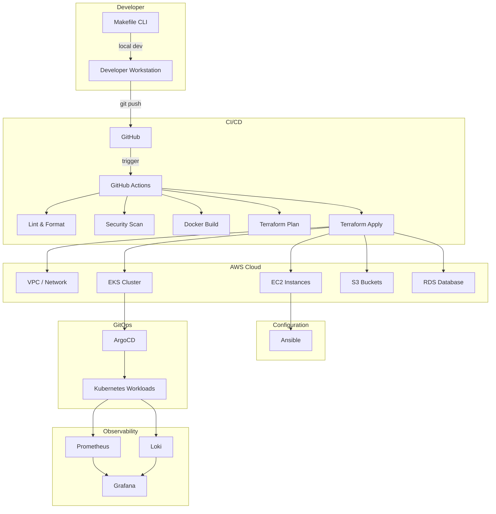
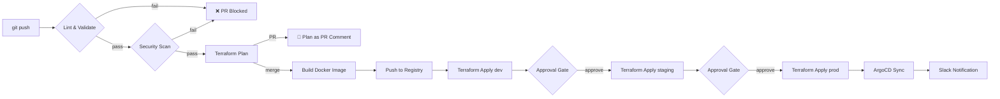
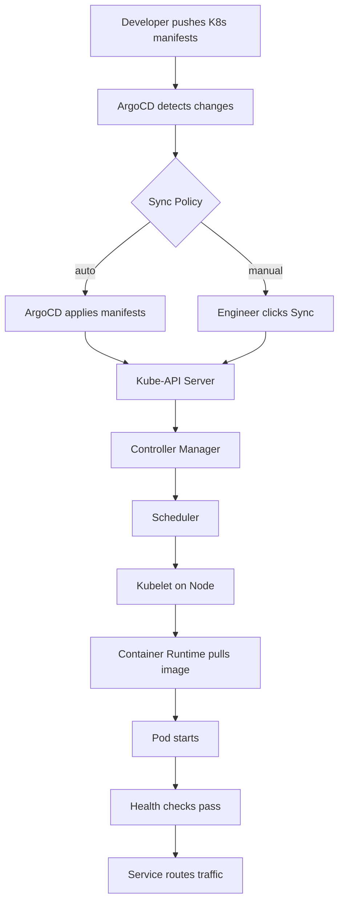
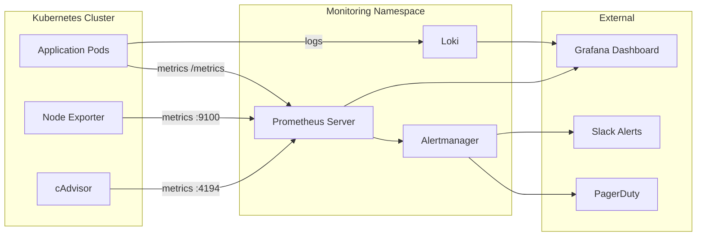
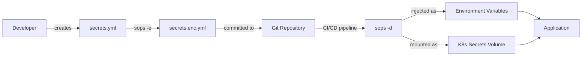

# Architecture

This document provides visual and descriptive architecture diagrams for the Infrastructure Boilerplate project.

---

## High-Level System Architecture



---

## CI/CD Pipeline Flow



---

## Kubernetes Deployment Flow (GitOps)



---

## Network Topology (AWS)

```
┌─────────────────────────────────────────────────────────────┐
│  VPC: 10.0.0.0/16                                           │
│                                                             │
│  ┌──────────────┐  ┌──────────────┐                        │
│  │ Public Sub A │  │ Public Sub B │                        │
│  │ 10.0.1.0/24  │  │ 10.0.2.0/24  │                        │
│  │              │  │              │                        │
│  │  ┌────────┐  │  │  ┌────────┐  │                        │
│  │  │  NLB   │  │  │  NAT GW  │  │                        │
│  │  └────────┘  │  │  └────┬───┘  │                        │
│  └──────────────┘  └───────┼───────┘                        │
│                            │                                │
│  ┌──────────────┐  ┌───────▼───────┐                        │
│  │ Private Sub A│  │ Private Sub B │                        │
│  │ 10.0.10.0/24 │  │ 10.0.20.0/24  │                        │
│  │              │  │               │                        │
│  │  ┌────────┐  │  │  ┌────────┐   │                        │
│  │  │  App   │  │  │  │  App   │   │                        │
│  │  │ Server │  │  │  │ Server │   │                        │
│  │  └────────┘  │  │  └────────┘   │                        │
│  └──────────────┘  └───────────────┘                        │
│                                                             │
│  ┌──────────────┐  ┌──────────────┐                        │
│  │ Isolated A   │  │ Isolated B   │                        │
│  │ 10.0.30.0/24 │  │ 10.0.40.0/24 │                        │
│  │              │  │              │                        │
│  │  ┌────────┐  │  │  ┌────────┐  │                        │
│  │  │  RDS   │  │  │  RDS     │  │                        │
│  │  │ Primary│  │  │  Replica │  │                        │
│  │  └────────┘  │  │  └────────┘  │                        │
│  └──────────────┘  └──────────────┘                        │
└─────────────────────────────────────────────────────────────┘
```

---

## Monitoring Stack Architecture



---

## Secret Management Flow


